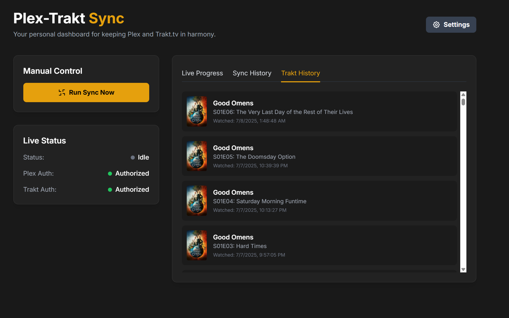

# Plex-Trakt Sync v2.0: A Modern, Robust Sync Dashboard

  

A sophisticated, self-hosted web application designed to provide a seamless and visually rich experience for synchronizing media watch history between a personal Plex server and a Trakt.tv account. This project was born from the need to overcome the limitations of existing command-line tools, creating a definitive, user-centric dashboard that is both powerful and intuitive.

Where other solutions were deemed "impossible" due to the complexities of managing disparate metadata sources, API rate limits, and large media libraries, this application succeeds by implementing a robust and scalable architecture. It stands as a testament to a vision for a better user experience, breaking the "Golden Standard" to create something new.

---



---

## Key Features

*   **Polished Web Interface:** A clean, modern UI built with Flask and Tailwind CSS provides a professional and intuitive dashboard for all operations.
*   **Manual & Scheduled Syncing:** Run a sync on-demand with a single click or set a schedule for automated, hands-off synchronization.
*   **Secure, Modern Authentication:** Utilizes the latest OAuth2 Device and PIN flows for both Trakt and Plex, ensuring secure and easy authorization without ever needing to manually expose passwords.
*   **Live Log Streaming:** A dedicated "Live Progress" tab streams the backend log directly to the UI during a sync, providing real-time insight into the process.
*   **Definitive Visual History:** The "Trakt History" tab provides the ultimate confirmation of a successful sync. It renders a fluid, chronological list of your entire watch history, complete with poster art fetched from TMDB, perfectly mirroring your official Trakt profile.
*   **Robust Error Handling & Retries:** The application is built to be resilient, automatically handling network errors and Trakt API rate limits with intelligent retry logic.

## Technical Architecture

This application employs a sophisticated, multi-layered architecture designed for stability, scalability, and a seamless user experience.

*   **Backend:** A **Flask** web server, served by the production-ready **Waitress** WSGI, handles all API requests and business logic.
*   **Frontend:** A dynamic, single-page application powered by **vanilla JavaScript** and styled with **Tailwind CSS** for a modern and responsive design.
*   **Plex Integration:** Utilizes the `PlexAPI` library for stable and reliable communication with the user's Plex Media Server.
*   **Trakt Integration (A Hybrid Approach):**
    *   **Sync Logic:** The core synchronization engine uses the `pytrakt` library, leveraging meticulously tested logic to handle the complexities of matching and submitting watch history.
    *   **History Display:** To overcome the library's rate-limiting and data structure inconsistencies, the history tab is powered by direct, authenticated API calls using the `requests` library. This ensures the UI is always fast, reliable, and accurate.
*   **Metadata:** Poster art and metadata are fetched from **The Movie Database (TMDB)** API, providing rich visuals without impacting Trakt API rate limits.
*   **Data Persistence:**
    *   `config.json`: Securely stores all user settings and API credentials.
    *   `sync_history.json`: Maintains a log of the last 50 sync runs for archival and debugging purposes.

## Overcoming the "Impossible" Challenge

A central challenge of this project was fetching and displaying a user's complete, chronological Trakt watch history—a task complicated by the Trakt API's rate limits and the `pytrakt` library's inconsistent data structures.

Initial attempts to "re-hydrate" every show object by making individual API calls proved unscalable, immediately triggering rate limits. Conversely, the library's built-in history methods failed to provide the necessary data for poster lookups.

The final, successful architecture solves this by using the **correct tool for the job**:
1.  The `pytrakt` library is used for its strength: the core, item-by-item sync logic.
2.  The `requests` library is used to make a direct, efficient call to the Trakt `sync/history` endpoint with `extended=full` data. This single call bypasses the library's limitations, retrieving the complete, combined history with all necessary IDs in one go.

This hybrid approach is the key to the application's success, providing a feature that was previously deemed too complex to implement reliably.

## Installation & Setup

1.  **Clone the Repository:**
    ```bash
    git clone [your-repo-url]
    cd [your-repo-name]
    ```

2.  **Set up a Python Virtual Environment:**
    ```bash
    python -m venv venv
    source venv/bin/activate  # On Windows, use `venv\Scripts\activate`
    ```

3.  **Install Dependencies:**
    ```bash
    pip install -r requirements.txt
    ```

4.  **Run the Application:**
    ```bash
    python app.py
    ```
    The application will automatically open a new tab in your web browser at `http://localhost:8080`.

## Usage

1.  **First-Time Setup:**
    *   On first launch, the **Settings** modal will appear.
    *   Fill in your **Plex Server URL** and your **Trakt Client ID & Secret**.
    *   Click **Authorize Plex** and follow the on-screen instructions to link your Plex account. Your Plex Token will be filled in automatically.
    *   Click **Authorize Trakt** and follow the on-screen instructions to link your Trakt account.
    *   Click **Save Settings**.
    *   In Settings, click **Fetch Libraries** and select the Plex libraries you wish to sync.
    *   Click **Save Settings** again.

2.  **Running a Sync:**
    *   Click the **Run Sync Now** button on the main dashboard.
    *   You can monitor the detailed output in the **Live Progress** tab.

3.  **Viewing History:**
    *   The **Sync History** tab shows a log of past sync runs, including duration and the number of items added.
    *   The **Trakt History** tab provides a rich, visual confirmation of your current watched history on Trakt. It will automatically refresh after a sync is completed.

## License

This project is licensed under the MIT License. See the `LICENSE` file for details.