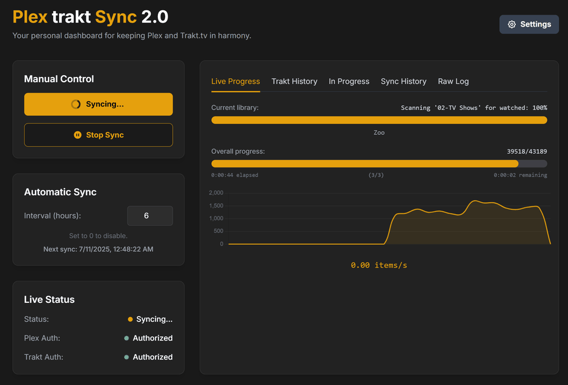

# Plex-Trakt Sync v2.0: The Definitive Modern Sync Dashboard

  

**Plex-Trakt Sync v2.0** is a sophisticated, self-hosted web application that completely redefines how you synchronize your media watch history between your personal Plex Media Server and your Trakt.tv account. Built from the ground up to overcome the critical limitations of prior "golden standard" solutions, this version delivers a **modern, professional, and feature-packed experience** that makes synchronization **accessible and powerful for all users**, not just advanced coders.

Where others settled for rudimentary terminal scripts, Plex-Trakt Sync v2.0 introduces a **sleek, intuitive UI** combined with a **much stronger and unique feature set**, all while maintaining a **smaller operational footprint**. It stands as a testament to pushing boundaries, bringing features never before available in a single, cohesive application.

---



---

## Key Features & Enhancements

Plex-Trakt Sync v2.0 delivers an unparalleled synchronization experience with its comprehensive set of features and significant enhancements:

*   **Polished & Responsive Web Interface:**
    *   A clean, modern UI built with Flask and Tailwind CSS provides a professional and intuitive dashboard for all operations.
    *   **Fully Responsive Settings Modal:** The "Settings" modal allows users to **load, modify, and persistently save all configuration options** (including API keys, sync direction, interval, and feature checkboxes) reliably to `config.json`.

*   **Advanced Authentication & Control:**
    *   **Seamless, Secure Authentication:** Utilizes the latest OAuth2 Device and PIN flows for both Trakt and Plex, ensuring **secure, fully functional, and easy authorization** without ever needing to manually expose passwords.
    *   **Manual & Automated Syncing:** Run a sync on-demand with a single click or set a schedule for automated, hands-off synchronization. The "Interval (hours)" input on the main dashboard offers **dynamic and persistent control** over automated sync schedules.
    *   **Granular Library Selection:** From the settings, users can **easily fetch and select specific Plex libraries** for synchronization, providing granular control over synced content.
    *   **Intuitive Sync Control:** Dedicated "Run Sync Now" and "Stop Sync" buttons offer **immediate and responsive control** over active sync processes, with clear visual feedback (e.g., "Syncing..." state).

*   **Comprehensive Live Sync Monitoring:**
    *   **Groundbreaking Real-time Sync Dashboard:** The "Live Progress" tab activates a sophisticated graphical dashboard during a sync, replacing simple text logs with a rich, "file transfer" like experience. It features:
        *   **Dual Dynamic Progress Bars:** The top bar tracks the progress of the current library scan, while the bottom bar shows the **100% accurate overall progress** across all selected libraries.
        *   **Live Item Display:** See the name of the specific movie or TV show being processed in real-time.
        *   **Live Speed Graph:** A dynamic chart visualizes the sync rate in items/second.
        *   **Full Suite of Metrics:** Real-time display of percentage, item counts (e.g., `22869/43189`), elapsed time, and estimated time remaining.
    *   **Enhanced Raw Log Tab:** For users who require maximum detail, a fully functional "Raw Log" tab runs alongside the dashboard. It provides the classic, verbose log output, now augmented with a live status header that displays the current sync state and the specific library being processed.
    *   **Polished Idle State:** When no sync is active, the dashboard presents a clean, styled inactive state, contributing to a professional and finished aesthetic.

*   **Accurate Data & Visual Histories:**
    *   **Precision "Items Scanned" Counter:** By **correctly counting every single movie and individual episode** before the sync begins, the application provides a verifiably accurate and reliable measure of the sync's total scope, resolving a common flaw found in other tools.
    *   **Timezone-Aware Watched History:** The application now **correctly identifies your server's local timezone and converts Plex's watch timestamps to UTC before sending them to Trakt.** This ensures all watched times displayed on Trakt.tv are perfectly accurate to your local viewing time.
    *   **Dedicated & Live Plex "In Progress" Tab:** A new "In Progress" tab **directly fetches and displays your Plex server's live "Continue Watching" (On Deck) items in real-time,** providing an immediate and dynamic overview of your current Plex activity.
    *   **Definitive Trakt Visual History:** The "Trakt History" tab provides the ultimate confirmation of a successful sync. It leverages API pagination to efficiently fetch and render an extensive, chronological list of up to **100 of your most recent watched items** from Trakt.tv, complete with poster art.

*   **Backend Stability & Performance:**
    *   **Intelligent Metadata Caching:** A persistent `trakt_metadata_cache.json` file is now used to store TV show metadata. After the first run, subsequent scans are **dramatically faster**, as API calls for existing shows are eliminated, significantly reducing rate-limiting issues and improving performance.
    *   **Robust API Resilience:** The application is built to be exceptionally resilient. Its **`@retry` decorator implementation** is consistently applied to all API interactions, automatically handling network errors and Trakt API rate limits with a safe, 60-second backoff delay.
    *   **Failure Isolation:** Errors during a library scan (like a single failed API lookup) are now isolated. The application will log the error for the specific item and **continue the sync**, ensuring that one bad item doesn't terminate the entire process.
    *   **Robust Plugin Architecture & Centralized State:** All sync plugins correctly import and access shared state variables from a dedicated `state.py` file, guaranteeing the smooth and crash-free operation of all enabled sync features and preventing race conditions.
    *   **Self-Aware Application Launcher:** A launcher stub is built directly into `app.py`, guaranteeing that the application **always uses the correct Python virtual environment** and its dependencies, permanently fixing `ModuleNotFoundError` issues.

## Technical Architecture

This application employs a sophisticated, multi-layered architecture designed for stability, scalability, and a seamless user experience.

*   **Backend:** A robust **Flask** web server, served by the production-ready **Waitress** WSGI, efficiently handles all API requests and business logic.
*   **Frontend:** A dynamic, single-page application powered exclusively by **vanilla JavaScript** for high performance and styled with **Tailwind CSS** for a modern, responsive design.
*   **Plex Integration:** Utilizes the `PlexAPI` library for stable and reliable communication with the user's Plex Media Server.
*   **Trakt Integration (A Hybrid & Optimized Approach):**
    *   **Sync Logic:** The core synchronization engine leverages the `pytrakt` library, applying meticulously tested and optimized logic for matching and submitting watched history.
    *   **UI Data Fetching:** To ensure the UI remains fast and reliable, custom **direct, authenticated API calls using the `requests` library** are made to Trakt's `sync/history` and `sync/playback` endpoints, bypassing potential library limitations.
*   **Metadata:** Rich poster art and metadata are consistently fetched from **The Movie Database (TMDb)** API, ensuring high-quality visuals across the dashboard.
*   **Real-time Progress Engine:**
    *   A dedicated **progress updater thread** runs during a sync, calculating the true overall progress based on an accurate pre-scan item count.
    *   The **sync plugin** itself is the single source of truth for progress within a specific library, directly updating the application's state to drive the UI bars and text fields, eliminating all data conflicts.
*   **Centralized State Management:** A dedicated `state.py` module centralizes all global application state variables, threading locks, and critical counters, ensuring robust, thread-safe, and highly maintainable management of real-time sync progress.
*   **Data Persistence:**
    *   `config.json`: Securely stores all user settings, API credentials, and authorization tokens.
    *   `sync_history.json`: Maintains a chronological log of the last 50 sync runs, including duration and accurately tracked items scanned.
    *   `trakt_metadata_cache.json`: Persistently caches TV show metadata to dramatically accelerate subsequent syncs and reduce API calls.

## Overcoming the "Impossible" Challenge

A central challenge of this project was delivering a rich, interactive experience and fetching a user's complete, chronological Trakt watch history and live Plex "Continue Watching" lists—tasks frequently deemed "impossible" or too complex for a self-hosted dashboard. This project rises to that challenge:

1.  **Robust ID Matching:** The application meticulously handles complex ID matching across Plex, Trakt, and TMDb to ensure accurate synchronization and metadata display, using custom logic where standard library conventions fail.
2.  **Optimized API Interactions:** The `pytrakt` library is leveraged for its core sync strengths, while direct `requests` calls are employed where greater efficiency and data richness are required for the UI, bypassing common library limitations.
3.  **Accurate Metric Tracking:** Fundamental to its reliability, the application features a precisely engineered system for pre-calculating and tracking "items scanned," providing true, verifiable metrics of each sync operation's scope.
4.  **Custom-Engineered Logic:** This hybrid, custom-engineered approach is the key to the application's unique success, providing features and a level of detail and control previously unavailable in this category of software.

## Installation & Setup

1.  **Clone the Repository:**
    ```bash
    git clone https://github.com/james702283/Plex-Trakt-Sync-2.0.git
    cd Plex-Trakt-Sync-2.0
    ```

2.  **Set up a Python Virtual Environment:**
    ```bash
    python -m venv venv
    source venv/bin/activate  # On Windows, use `venv\Scripts\activate`
    ```

3.  **Install Dependencies:**
    *   The required dependencies are listed in `requirements.txt`.
    *   Install using:
        ```bash
        pip install -r requirements.txt
        ```

4.  **Run the Application:**
    ```bash
    python app.py
    ```
    The application features a robust launcher that automatically detects and utilizes the correct Python virtual environment, ensuring a flawless start.

## Usage

1.  **First-Time Setup:**
    *   On first launch, open a web browser to `http://localhost:8080`.
    *   Click the **Settings** button.
    *   Fill in your **Plex Server URL** and your **Trakt Client ID & Secret**.
    *   Click **Authorize Plex** and follow the on-screen instructions to link your Plex account. Your Plex Token will be filled in automatically.
    *   Click **Authorize Trakt** and follow the on-screen instructions to link your Trakt account.
    *   Click **Save Settings**.
    *   In Settings, select the Plex libraries you wish to sync.
    *   Click **Save Settings** again.

2.  **Running a Sync:**
    *   Click the **Run Sync Now** button on the main dashboard.
    *   Monitor the detailed output and progress in the **Live Progress** tab.

3.  **Viewing History:**
    *   The **Sync History** tab shows a log of past sync runs.
    *   The **Trakt History** tab provides a rich, visual confirmation of your current watched history on Trakt.
    *   The **In Progress** tab gives a live overview of what you're currently watching on Plex.

## License

This project is licensed under the MIT License. See the `LICENSE` file for details.```